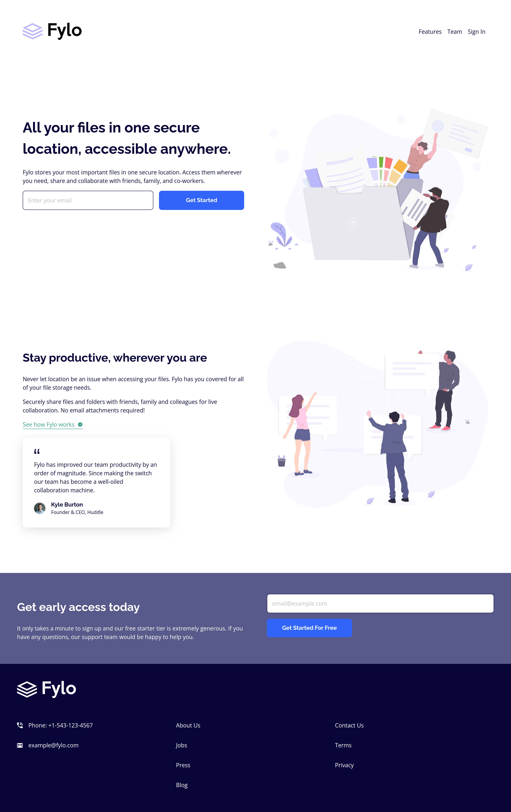

# Frontend Mentor - Fylo landing page with two column layout solution

This is a solution to the [Fylo landing page with two column layout challenge on Frontend Mentor](https://www.frontendmentor.io/challenges/fylo-landing-page-with-two-column-layout-5ca5ef041e82137ec91a50f5). Frontend Mentor challenges help you improve your coding skills by building realistic projects.

## Table of contents

-   [Overview](#overview)
    -   [The challenge](#the-challenge)
    -   [Screenshot](#screenshot)
    -   [Links](#links)
-   [My process](#my-process)
    -   [Built with](#built-with)
    -   [What I learned](#what-i-learned)
    -   [Continued development](#continued-development)
    -   [Useful resources](#useful-resources)
-   [Author](#author)

## Overview

### The challenge

Users should be able to:

-   View the optimal layout for the site depending on their device's screen size
-   See hover states for all interactive elements on the page

### Screenshot



### Links

-   Solution URL: [https://github.com/alvaro-jrr/fylo-landing-page](https://github.com/alvaro-jrr/fylo-landing-page)
-   Live Site URL: [Add live site URL here](https://your-live-site-url.com)

## My process

### Built with

-   Semantic HTML5 markup
-   CSS custom properties
-   Flexbox
-   CSS Grid
-   Mobile-first workflow

**Note: These are just examples. Delete this note and replace the list above with your own choices**

### What I learned

I'm proud of the work I did, the CSS code I'm most proud of is the one below:

```css
.section {
	margin-top: var(--spacing-between-section);
	padding: var(--spacing);
}

@media (min-width: 1024px) {
	.section {
		display: grid;
		grid-template-columns: repeat(2, 1fr);
		gap: var(--spacing);
	}
}
```

That's the CSS for every section of the page, it's a one column layout for mobiles but when it reaches the minimum width of 1024px it changes to a two column layout.

### Continued development

I want to improve in CSS class naming and how to add white space correctly.

### Useful resources

-   [Josh's Custom CSS Reset ](https://www.joshwcomeau.com/css/custom-css-reset/) - This helped me reset my CSS and gave me more knowledge due the way it works.

## Author

-   Github - [Alvaro Resplandor](https://github.com/alvaro-jrr)
-   Frontend Mentor - [@alvaro-jrr](https://www.frontendmentor.io/profile/alvaro-jrr)
